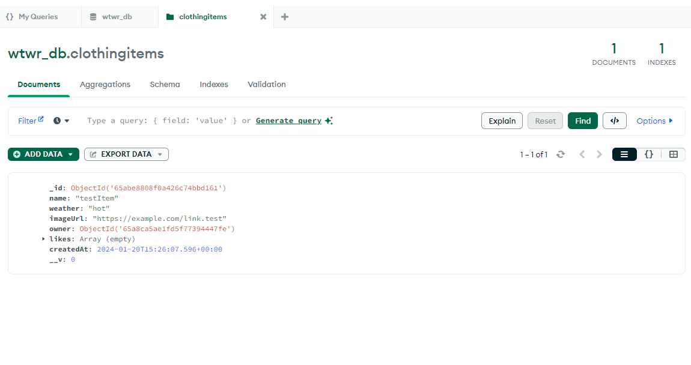
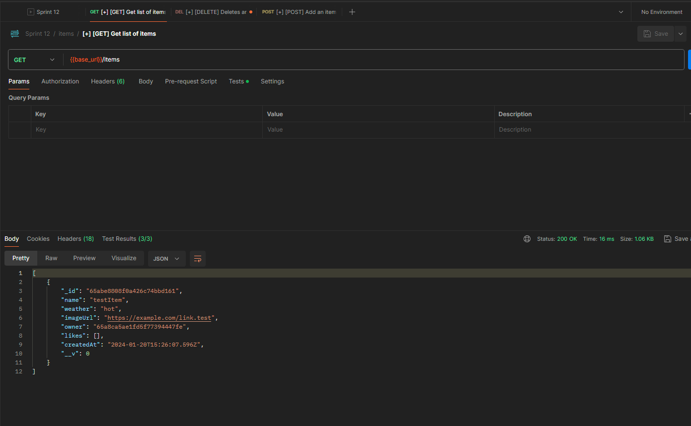
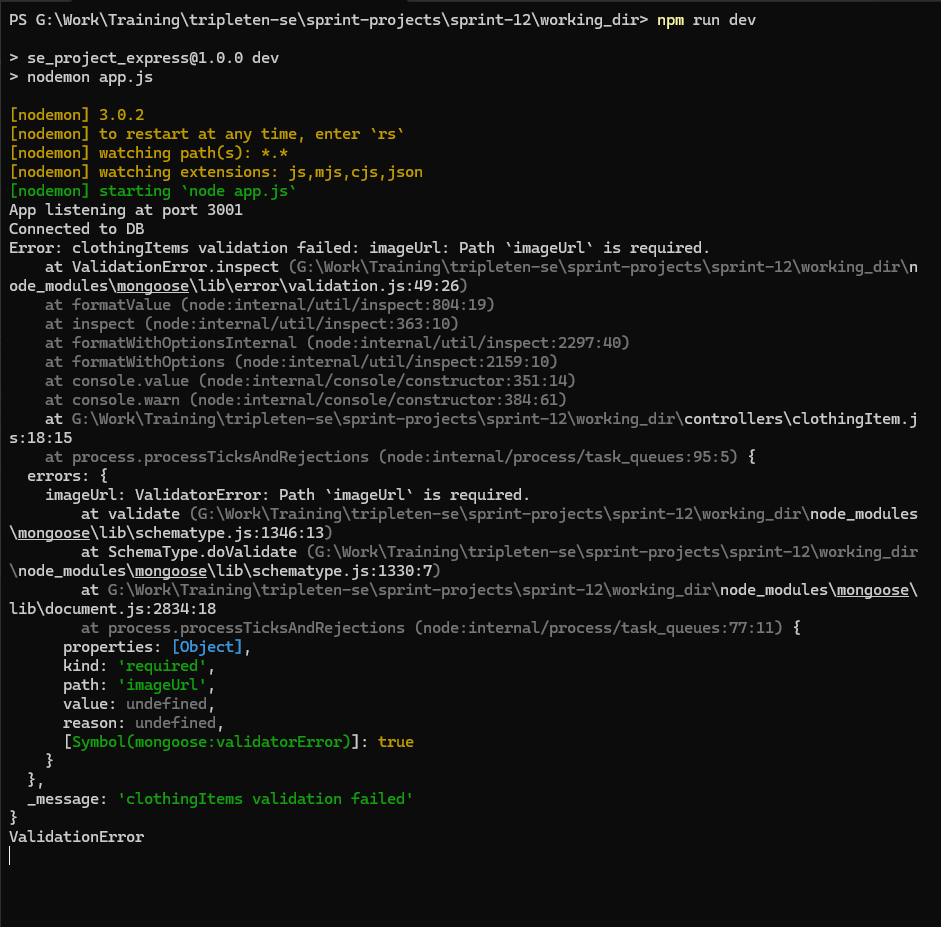

# WTWR (What to Wear?): Back End
The WTWR back-end uses the MERN (MongoDB, Express, React, Node) stack to implement the beginnings of a RESTful API for use by the WTWR front-end application. This is accomplished using MongoDB as the database, Express.js as the primary library with React and Node as heavy lifters. Some basic error handling was built out in the repository and tested using Postman; this will be more fully fleshed out in later iterations. The eventual goal is to create a server with an API and user authorization.

## Running the Project
`npm run start` — to launch the server 

`npm run dev` — to launch the server with the hot reload feature

## Images 
clothingItem database schema shown in Compass. 
testing various error handling functions in Postman 
testing missing imageUrl value in terminal 
